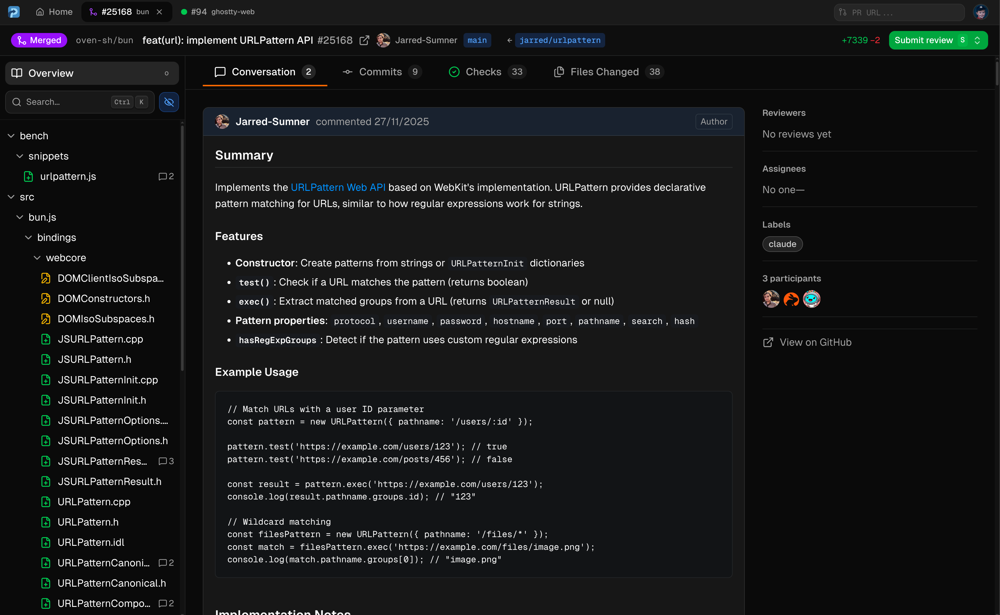
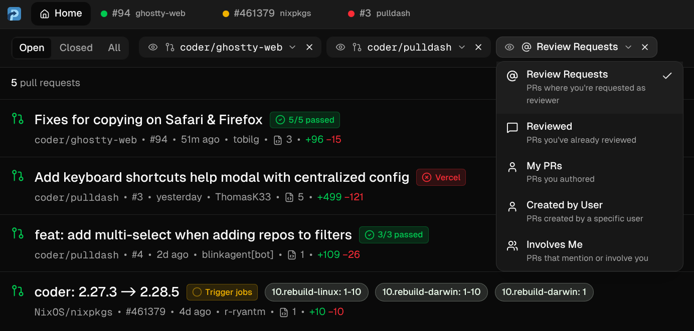
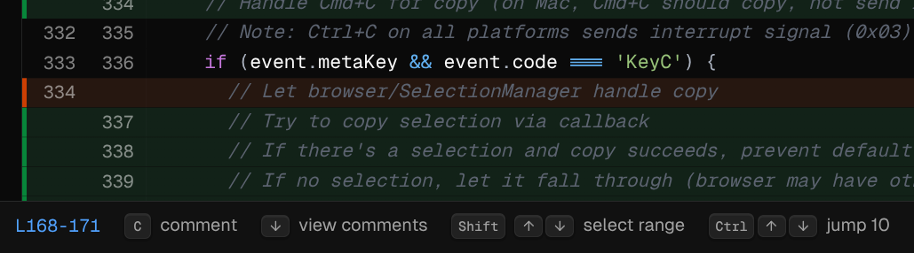
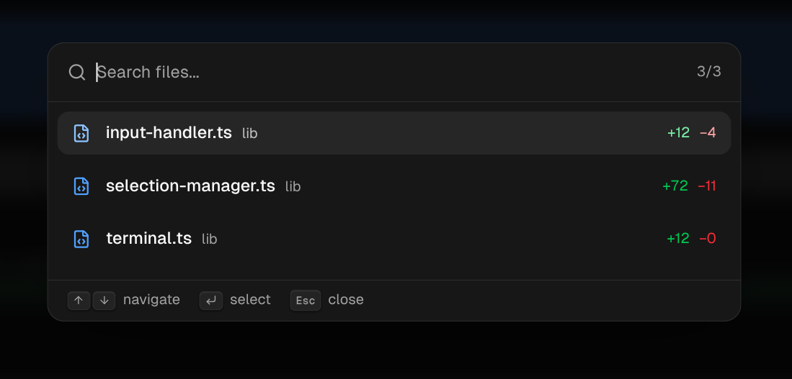

<h1>
  
  Pulldash
</h1>

Fast, filterable PR review. Entirely client-side.

> [!WARNING]
> Pulldash is in alpha. Please report bugs.

[](https://pulldash.com)

## Why

- GitHub's review UI is slow
- No way to filter PRs by repo or query
- AI tooling means more PRs than ever

## Try It

**Browser**: [pulldash.com](https://pulldash.com). Replace `github.com` with `pulldash.com` in any PR URL.

**Desktop**: [Latest release](https://github.com/coder/pulldash/releases) for Linux, macOS, Windows.

## Features

- **Custom filters**: Save queries like `repo:org/frontend is:open`. Focus on what matters.

  

- **Keyboard-driven**: `j`/`k` to navigate files, arrows for lines, `c` to comment, `s` to submit.

  

- **Fast file search**: `Ctrl+K` to fuzzy-find across hundreds of changed files.

  

## How It Works

GitHub's API supports [CORS](https://docs.github.com/en/rest/using-the-rest-api/using-cors-and-jsonp-to-make-cross-origin-requests), so Pulldash runs entirely client-side. No backend proxying your requests.

- **Web Worker pool**: Diff parsing and syntax highlighting run in workers sized to `navigator.hardwareConcurrency`. The main thread stays free for scrolling.

- **Pre-computed navigation**: When a diff loads, we index all navigable lines. Arrow keys are O(1)—no DOM queries.

- **External store**: State lives outside React ([`useSyncExternalStore`](https://react.dev/reference/react/useSyncExternalStore)). Focusing line 5000 doesn't re-render the file tree.

- **Virtualized rendering**: Diffs, file lists, and the command palette only render visible rows.

## Development

```bash
bun install
bun dev
```

## License

[AGPL](./LICENSE)
